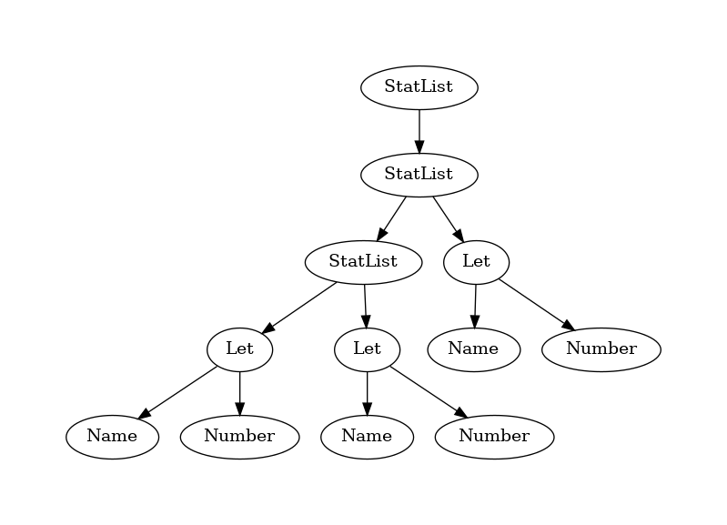

# Fern
A parallel compiler implementation. Name is wip.

> Papageno sounds like an italian chippers - Jim Ryan, 2023

*README updated 4th August 2023*

Use rust nightly-2023-06-28 

## Intro  
Lexer / parser is based on [this paper](https://doi.org/10.1016/
j.scico.2015.09.002). Ir code and code gen is much more wip and ad hoc as I'm
going by trial and error. If I find some decent research for ir or code gen then
I'll implement it instead.

The general goal is to write a compiler for a functional (not the paradigm,
functional as in practical) language where each stage of the compiler is fully
parallel. The only noticeable output right now (and for the foreseeable future)
is graphs in dot language. `ast.dot` is the abstract syntax tree and `ir.dot` is
the intermediate representation. Example graphs:

### AST
```
fn main (argc, argv) {
    let x = 3 + 4 / 10 * 30;

    if x {
        let y = 3 * 3 / 100;
    }

    return y;
}

fn other() {
    let y = "this is a string";
    let x = "best type checker is no type checker" / 3;
    return x;
}

```



### IR
```
fn main (argc, argv) {
    let x = 3 + 4 / 10 * 30 - 100;
    let y = 300;
    if y > 100 {
        let z = 30 + 40 - 30;
    }
    return y + 3;
}
```


## Syntax goals
This is the syntax I'm aiming for. the grammar isn't fully fleshed out yet so
this isn't parseable yet
```
let print = @include("std").print;

fn add(a: u32, b: u32) -> u32 {
    return a + b;
}

fn main() {
    let i: u32 = 0;
    if i > 10 {
        while i < 10 {
            let x = add(i , i + 1);
            print(x);
            i = i + 1;
        }
    }
}
```

## Useful commands

Scripts for graphs are in the scripts folder.

Run the compiler (compile [data/test.fern](data/test.fern))
```bash
cargo run
```

run the script in './scripts/webdev.sh' to host the static website with live reload (requires `cargo install penguin-app`)

Perf script 
```bash
perf script record -F997 --call-graph dwarf,16384 -e cpu-clock 
```
